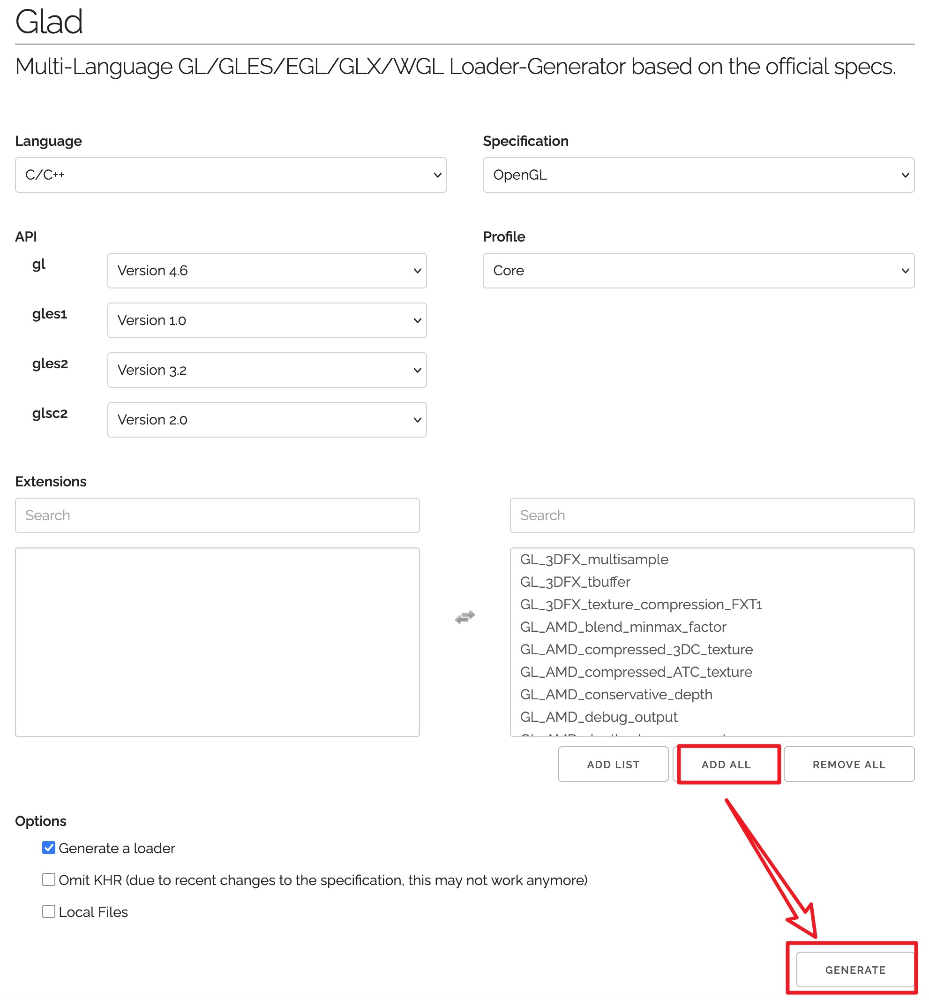

## 工程编译
```shell
$ cmake -B build -S .
$ cmake --build build -j
```
## [编译 qt5](https://download.qt.io/archive/qt/)
- ### [编译 opengl]
    - #### [编译 glfw](https://www.glfw.org/download.html)
        ```shell
        $ wget https://github.com/glfw/glfw/releases/download/3.4/glfw-3.4.zip
        $ unzip glfw-3.4.zip && cd glfw-3.4
        $ cmake -B build -S . -DCMAKE_INSTALL_PREFIX=/data/workspace/cpp_ffmpeg/install/glfw-3.4
        $ cd build && make -j6
        $ make install
        ```
    - #### [安装 glad](https://glad.dav1d.de/)
        - 

- ### [编译 qt5](https://download.qt.io/archive/qt/)
```shell
$ wget https://download.qt.io/archive/qt/5.14/5.14.2/single/qt-everywhere-src-5.14.2.tar.xz
$ tar -xf qt-everywhere-src-5.14.2.tar.xz && cd qt-everywhere-src-5.14.2
$ vim qtbase/src/corelib/global/qfloat16.h
# 添加：
#include <limits>
$ vim qtbase/src/corelib/text/qbytearraymatcher.h
# 添加：
#include <limits>
$ ./configure \
    -release \
    -no-opengl \
    --prefix=/data/workspace/cpp_ffmpeg/install/qt5-v5.14.2 \
    -nomake tests
$ make -j10
$ make install
```

## [编译 x264](https://www.linuxfromscratch.org/blfs/view/svn/multimedia/x264.html)
```shell
$ ./configure \
    --prefix=/data/workspace/cpp_ffmpeg/install/x264-20250815 \
    --enable-shared \
    --disable-cli
$ make -j6
$ make install
```

## [编译 x265](https://www.x265.org/downloads/)[Download](https://bitbucket.org/multicoreware/x265_git/downloads/)
```shell
$ apt install cmake-curses-gui
$ cd x265_4.1/build/aarch64-darwin
$ ./make-Makefiles.bash  # 修改CMAKE_PREFIX_INSTALL，改为目标install目录
$ make -j6
$ make install
```

## 编译 fdk-acc
```shell
$ git clone https://github.com/mstorsjo/fdk-aac.git
$ cmake -B build -S . -DCMAKE_BUILD_TYPE=Release -DCMAKE_INSTALL_PREFIX=/data/workspace/cpp_ffmpeg/install/fdk-aac
$ cmake --build build -j
$ cd build && make install
```

## [编译 ffmpeg](https://github.com/FFmpeg/FFmpeg)
```shell
$ export PKG_CONFIG_PATH=/data/workspace/cpp_ffmpeg/install/x265_4.1/lib/pkgconfig:$PKG_CONFIG_PATH
$ export PKG_CONFIG_PATH=/data/workspace/cpp_ffmpeg/install/x264-20250815/lib/pkgconfig:$PKG_CONFIG_PATH
$ export PKG_CONFIG_PATH=/data/workspace/cpp_ffmpeg/install/fdk-aac/lib/pkgconfig:$PKG_CONFIG_PATH
$ ./configure \
    --prefix=/data/workspace/cpp_ffmpeg/install/FFmpeg-n4.3.9 \
    --enable-shared \
    --enable-static \
    --disable-programs \
    --disable-ffplay \
    --disable-ffmpeg \
    --disable-ffprobe \
    --enable-gpl \
    --enable-libx264 \
    --enable-libx265 \
    --enable-libfdk-aac \
    --enable-nonfree
$ make -j6
$ make install
```